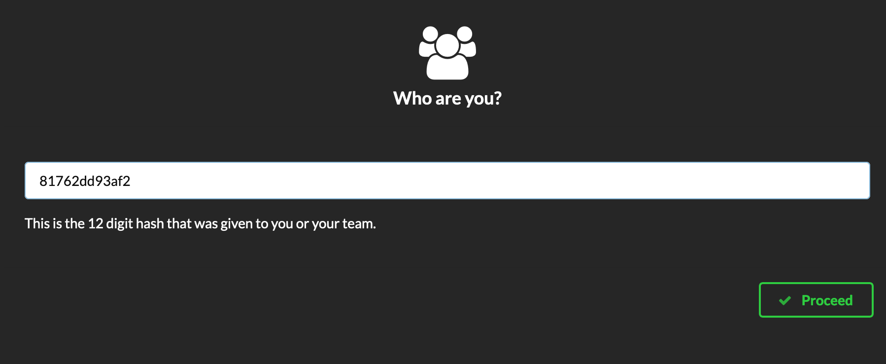

# EventEngineHowTo
1. 자신의 Hash를 확인 합니다. 

2. 다음 URL에 접속하여 자신의 Hash를 입력 합니다. 
[https://dashboard.eventengine.run/login](https://dashboard.eventengine.run/login)

3. Set Team Name 을 눌러서 이름을 입력합니다.

<kbd>   

</kbd>
