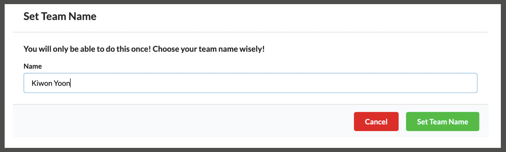

# EventEngineHowTo
1. 자신의 Hash를 확인 합니다. 

2. 다음 URL에 접속하여 자신의 Hash를 입력 합니다. 
[https://dashboard.eventengine.run/login](https://dashboard.eventengine.run/login)

3. Set Team Name 을 눌러서 이름 또는 팀명을 입력합니다.

<kbd>   

</kbd>
   

4. "Not Approved"가 "Approved"로 변경 될 떄까지 기다립니다. (Admin 승인 필요))
<kbd>

</kbd>
   

5. 승인 후에는 "Not Approved" Message가 없어집니다. 
<kbd>

</kbd>
   

6. ** AWS Console ** 을 Click합니다. 
   

7. ** Open Console ** 을 Click합니다. (필요시 Credentials를 메모장등에 복사합니다.)
   

8. 성공적으로 AWS Login 후 HOL을 진행합니다.
<kbd>

</kbd>

   

